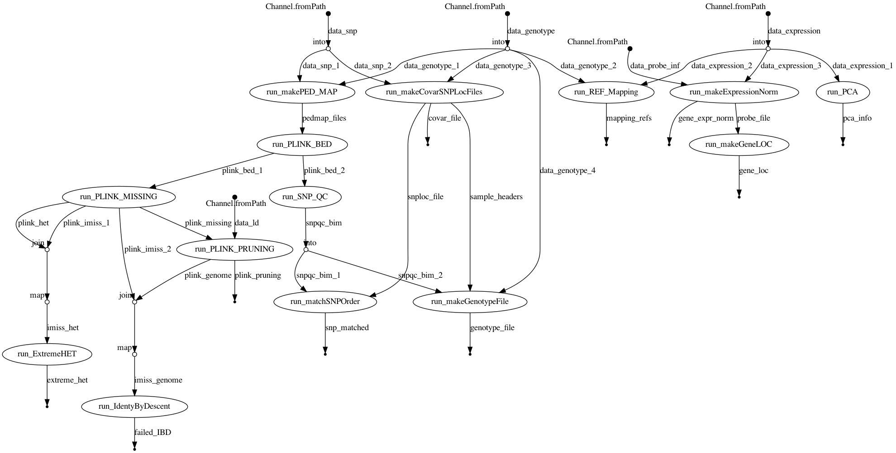

## EQTL Workflow

<p align="center">
    
</p>

### 1. Download data!
### 2. Set parameters
Edit the `myfiles.config` file with the necessary files you downloaded!
```
//USER INPUT PARAMETERS
params {
    genotype    = "data/GSE39036_series_matrix.txt"
    snp         = "data/GPL6980_HumanHap300v2_A.csv"
    ld_regions  = "data/high-LD-regions.txt"
    expression  = "data/GSE32504_series_matrix.txt"
    probe_inf   = "data/Probe_and_control_probe_info.txt"
}
```

### 3. Run the workflow
```
nextflow run main.nf -profile slurm -c myfiles.config
```

### 4. Remove failed samples
`<failed_genotype>` and  `<failed_expression>` below are the list of sampled that failed QC! 
```
perl remove_samples.pl outputs/geno_mapping.txt outputs/expr_mapping.txt <failed_genotype> <failed_expression>
```

### 5. Run the R script
```
Rscript cis_trans_eqtl.R
```

